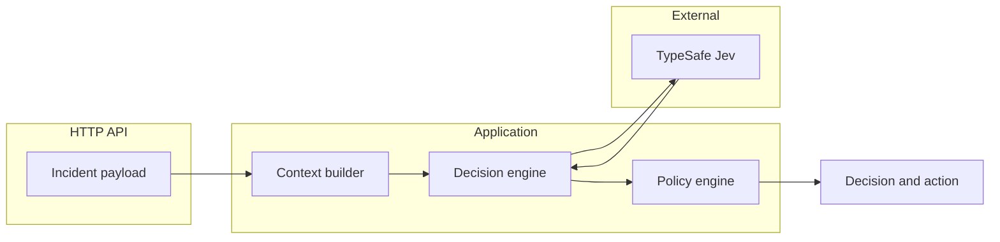

# SignalGate

SignalGate is a software-engineering showcase and a small proof of concept. It shows how a production incident path can classify, prioritize, and route a signal before any automated action runs.

```text
Telemetry → Context → Decision → Policy → Action
```

An incident arrives as logs, metrics, or a simulated payload. A decision engine, starting with [Jev](https://docs.typesafe.ai) (TypeSafe's System One model), returns a structured classification. Deterministic policy code then chooses the action. The model never shells out, never touches infrastructure, and never applies the policy itself.

**Status:** specification is in place. Application code is not. The first release is a thin slice, not the full platform.

## Problem

Automated incident response fails in two familiar ways. A pile of rules grows brittle as soon as a signal looks slightly new. A general language model can classify the same signal and still be the wrong component to press the button: it is probabilistic, it can be wrong, and its output is a poor audit record.

SignalGate splits those jobs. Classification can be probabilistic. Execution is deterministic, tested, and recorded.

## Architecture



The domain does not import the Jev SDK. `JevDecisionEngine` is one `DecisionEngine`. Later phases can add a rule engine and an LLM behind the same interface and compare them on a fixed set of incidents.

The target design, including security boundaries and the v0.1 cut, is in [docs/architecture.md](docs/architecture.md). The release sequence is in [docs/roadmap.md](docs/roadmap.md).

## Why Jev

Jev answers a question you define. A choice returns one label and a distribution. A score returns a value on a short ordered legend. Both carry a confidence the application can reject. That is a closer fit to "which domain, how bad" than asking a chat model for a paragraph and parsing it.

## Why not only an LLM

An LLM can still be a third engine, in a later phase, on the same incidents and the same policy. The comparison is the point. SignalGate does not assume Jev is more accurate. It assumes the action path must stay boring code either way.

## What ships first

v0.1 is Incident → Jev → Decision → Policy → Response, stored in memory, with 6–10 scenarios and tests. PostgreSQL, Redis, OpenTelemetry, and the benchmark harness wait until that slice is real. Restarting the process forgets history until the audit phase.

## Getting started

Node.js 24 (see `.nvmrc`) and pnpm 10. Copy `.env.example` to `.env`. `TYPESAFE_API_KEY` is required only for a live Jev call. The test suite passes without it.

```sh
pnpm install
pnpm test
pnpm dev
```

The API listens on `127.0.0.1:3000` unless `HOST` and `PORT` say otherwise.

```sh
docker compose up --build
```

In Docker the process listens on `0.0.0.0:3000`. History is still in memory and disappears when the container stops.

## Further reading

- [Architecture](docs/architecture.md)
- [Roadmap](docs/roadmap.md)
- [Contributing](CONTRIBUTING.md)
- [Security](SECURITY.md)
- [ADRs](docs/adr/)
