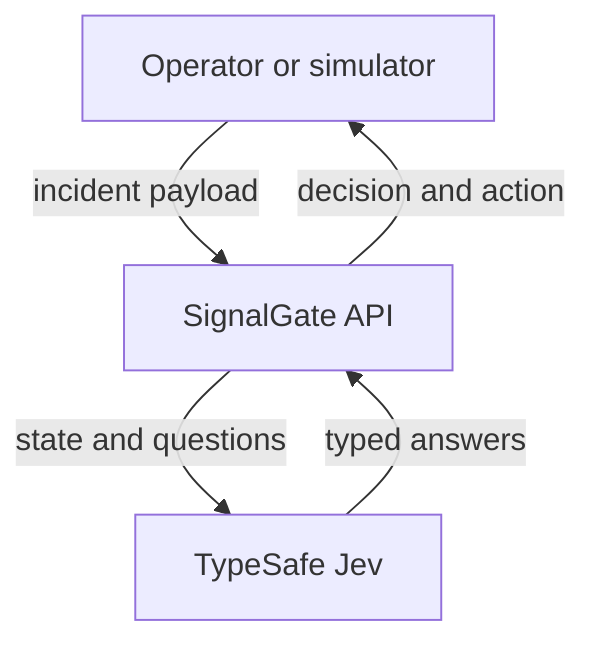
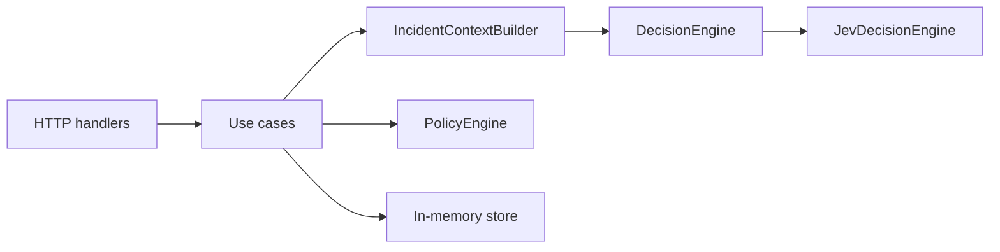
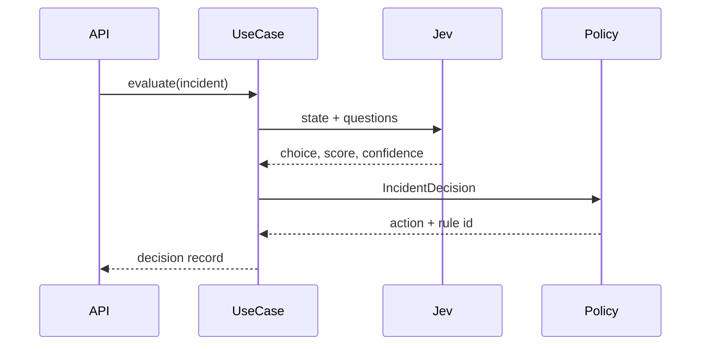

# Architecture

SignalGate is a single Node.js service. v0.1 keeps every state in memory so the decision path can be read from one end to the other.

## Context

Operators, or a simulator, submit an incident. The service returns a classification and an action. The only external system in v0.1 is TypeSafe's Jev API, and only when a live evaluation is requested. Tests use recorded answers.

## Containers

| Container         | v0.1                       | Later                 |
| ----------------- | -------------------------- | --------------------- |
| HTTP API          | Fastify                    | same                  |
| Decision provider | Jev via `@typesafe-ai/sdk` | rule engine, LLM      |
| Store             | in-memory                  | PostgreSQL in v0.3    |
| Telemetry         | structured logs            | OpenTelemetry in v0.4 |

Redis is optional and has no phase until a measured need exists.

## Components

Handlers validate and map HTTP. Use cases order the work. The context builder normalizes telemetry into the state Jev will see. The Jev adapter asks the questions and maps answers. The policy engine is a pure function.

## Decision flow

1. Zod parses the body into an `Incident`. Invalid payloads never reach the domain.
2. The context builder selects the fields the questions need. It does not classify.
3. `JevDecisionEngine` calls `systemOne` with a domain `choice` and a severity `score`.
4. A pure mapper turns the score into a severity from 0 to 100 and aggregates confidence from fields the SDK actually returns.
5. `PolicyEngine` applies the precedence in `.cursor/context/domain.md`.
6. The use case stores a decision record: incident, decision, model id, policy id, action, timing, input hash.

## Security boundary

Anything returned by Jev is untrusted input. The adapter checks labels, numeric ranges, and the presence of expected answers. The policy then runs on the checked decision.

Allowed actions in v0.1 are labels: `none`, `notify`, `page`, `human_review`. There is no executor for shell, SQL, deploys, or configuration.

The TypeSafe API key stays in the environment. Logs may carry `requestId`, `incidentId`, `decisionEngine`, `severity`, and `confidence`. They must not carry the key, credentials found in metadata, or raw secrets.

## Trade-offs

- In-memory history is lost on restart. That is accepted until the audit phase, so the first review of the repo is about the decision path.
- `DecisionEngine` and `IncidentRepository` are ports so use cases do not import adapters. The layer rules are in `.cursor/harness/ddd.md`.
- Policy is small and ordered, not a rules DSL. A DSL can wait until the precedence table no longer fits in one function.
- Live model output is not the oracle in CI. Recorded answers keep the suite deterministic. Accuracy against labels is a benchmark concern, not a unit-test concern.
